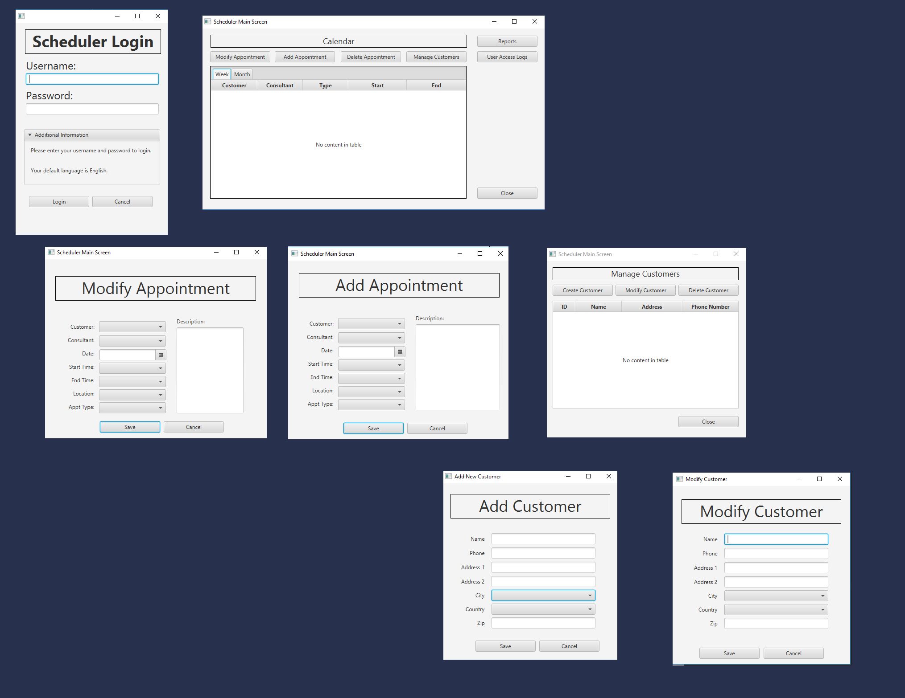

# TE_Scheduler
Appointment Scheduler Java Application

Unfortunately, this application was created for a university class and used a remote database controlled by the school. 
The database no longer exists so a lot of the functionality does not work due to that. 
The methods and techniques in the code still stand.  This could be updated to use a new database which would resolve these issues. 

Below you will find the layout of this application:

